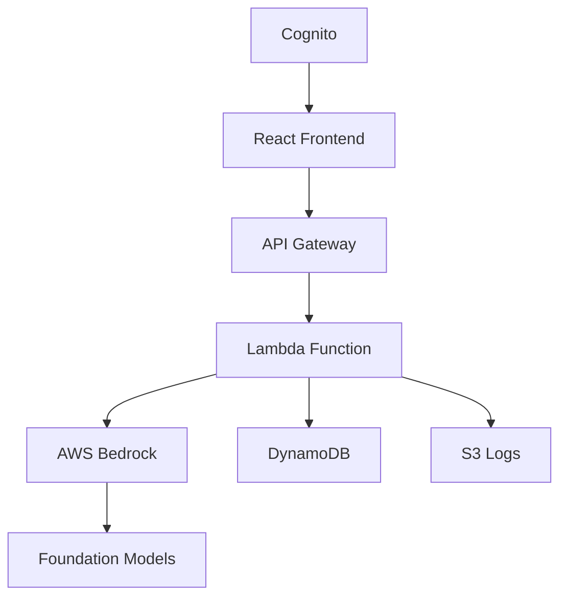

# 🚀 AWS Bedrock GenAI Chatbot

A production-ready, enterprise-grade GenAI chatbot platform powered by AWS Bedrock foundation models. Features multiple AI providers (Anthropic, Meta, AI21), domain-specific expertise, and scalable serverless architecture.

[](https://aws.amazon.com/bedrock/)
[](https://reactjs.org/)
[](https://python.org/)
[](LICENSE)

## 🌟 Live Demo

**🚀 Production Site**: [Your Live Chatbot](http://bedrock-chatbot-frontend-1751548447.s3-website-us-east-1.amazonaws.com)

## 🎯 Features

- **Multi-Model Support**: Claude 3, Llama 3, Jurassic-2
- **Domain Specialization**: HR, Medical, Legal, Finance, General
- **Real-time Chat**: React frontend with conversation history
- **Serverless Architecture**: Lambda + API Gateway + DynamoDB
- **Cost Optimization**: Smart model selection and caching
- **Authentication**: Optional AWS Cognito integration
- **Monitoring**: CloudWatch dashboards and cost tracking

## 🏗️ Architecture



## 🚀 Quick Start

### Prerequisites
- AWS CLI configured with appropriate permissions
- AWS SAM CLI installed
- Node.js 18+ for frontend
- Python 3.11+ for Lambda functions

### 1. Clone and Setup
```bash
git clone https://github.com/yourusername/aws-bedrock-chatbot.git
cd aws-bedrock-chatbot
```

### 2. Enable AWS Bedrock Models
1. Go to [AWS Bedrock Console](https://us-east-1.console.aws.amazon.com/bedrock/home?region=us-east-1#/modelaccess)
2. Click "Manage model access"
3. Enable: Anthropic Claude, Meta Llama, AI21 models
4. Save changes

### 3. Deploy to Production
```bash
# Deploy backend infrastructure
chmod +x scripts/deploy.sh
./scripts/deploy.sh

# Deploy frontend to production
./scripts/deploy-frontend-prod.sh
```

### 4. Local Development
```bash
# Start local frontend
./scripts/start-frontend.sh

# Test API
./scripts/test-api.sh
```

## 📊 Cost Estimates

| Usage Level | Monthly Cost | Details |
|-------------|-------------|---------|
| **Light** (1K msgs/month) | $10-50 | Primarily Bedrock costs |
| **Medium** (10K msgs/month) | $100-500 | + Lambda, DynamoDB |
| **Heavy** (100K msgs/month) | $1K-5K | + Storage, bandwidth |

## 🎯 Use Cases

### 👔 HR Assistant
- Employee policy questions
- Benefits and leave requests  
- Workplace guidelines
- **Example**: "What's our work from home policy?"

### 🏥 Medical Triage
- General health information
- Symptom assessment guidance
- First aid instructions
- **Example**: "I have a persistent cough, should I see a doctor?"

### ⚖️ Legal Document Explainer
- Contract clause explanations
- Legal concept clarification
- Document analysis
- **Example**: "Explain this NDA clause in plain language"

### 💰 Financial Analysis
- Report summarization
- Budget analysis  
- Financial metrics explanation
- **Example**: "Analyze our Q3 financial performance"

### 📄 Resume Optimizer
- Resume improvement suggestions
- Industry-specific advice
- Interview preparation
- **Example**: "How can I improve my software engineer resume?"

## 🔧 Configuration

### Model Selection
```python
# Smart model routing based on complexity
def select_optimal_model(query, domain):
    if len(query.split()) < 10:
        return 'claude-3-haiku'  # Fast, cheap
    elif len(query.split()) < 50:
        return 'claude-3-sonnet'  # Balanced
    else:
        return 'llama3-70b'  # Complex reasoning
```

### Domain Customization
```python
DOMAIN_PROMPTS = {
    'hr': 'You are an HR assistant...',
    'medical': 'You are a medical triage assistant...',
    'legal': 'You are a legal document assistant...',
    # Add your custom domains
}
```

## 📈 Monitoring & Analytics

### CloudWatch Metrics
- Bedrock token usage per model
- Lambda invocations and duration
- DynamoDB read/write capacity
- API Gateway request count
- Error rates and response times

### Cost Tracking
```python
# Automatic cost tracking per request
def track_bedrock_costs(model_id, input_tokens, output_tokens):
    cost = calculate_token_cost(model_id, input_tokens, output_tokens)
    send_to_cloudwatch(cost, model_id)
```

## 🔐 Security Features

### Authentication (Optional)
- AWS Cognito user pools
- JWT token validation
- Session management
- User quotas and rate limiting

### Data Protection
- Encryption at rest (DynamoDB, S3)
- HTTPS/TLS in transit
- IAM least privilege access
- No sensitive data logging

## 🚀 Production Deployment

### Infrastructure as Code
```bash
# Deploy with environment-specific settings
sam deploy --parameter-overrides \
    Environment=prod \
    CorsOrigin=https://your-domain.com
```

### CI/CD Pipeline
```yaml
# GitHub Actions example
- name: Deploy to AWS
  run: |
    sam build
    sam deploy --no-confirm-changeset
```

### Scaling Considerations
- Lambda concurrent execution limits
- DynamoDB auto-scaling
- API Gateway throttling
- CloudFront CDN for frontend

## 💡 Best Practices

### Cost Optimization
1. Use Claude 3 Haiku for simple queries
2. Implement response caching
3. Limit conversation history (3-5 exchanges)
4. Set up cost alerts and quotas
5. Monitor token usage patterns

### Performance
1. Enable Lambda provisioned concurrency for consistent latency
2. Use DynamoDB DAX for caching
3. Implement connection pooling
4. Optimize prompt lengths

### Security
1. Enable API Gateway API keys for production
2. Implement request signing
3. Use VPC endpoints for internal traffic
4. Regular security audits

## 📚 Documentation

- [Cost Optimization Guide](docs/cost-optimization.md)
- [Use Case Examples](examples/use-cases.md)
- [API Documentation](api-gateway/openapi-spec.yaml)
- [Deployment Guide](docs/deployment.md)

## 🤝 Contributing

1. Fork the repository
2. Create a feature branch
3. Make your changes
4. Add tests if applicable
5. Submit a pull request

## 📄 License

This project is licensed under the MIT License - see the [LICENSE](LICENSE) file for details.

## 🆘 Support

For issues and questions:
- Create an [Issue](https://github.com/your-repo/issues)
- Check [Troubleshooting Guide](docs/troubleshooting.md)
- Review [AWS Bedrock Documentation](https://docs.aws.amazon.com/bedrock/)

## 🎉 Acknowledgments

- AWS Bedrock team for foundation model access
- Anthropic, Meta, and AI21 for their excellent models
- AWS Serverless Application Model (SAM) for easy deployment
- React community for the frontend framework

---

**Built with ❤️ using AWS Bedrock, Lambda, and React**

**⭐ Star this repo if it helped you build your GenAI chatbot!**
