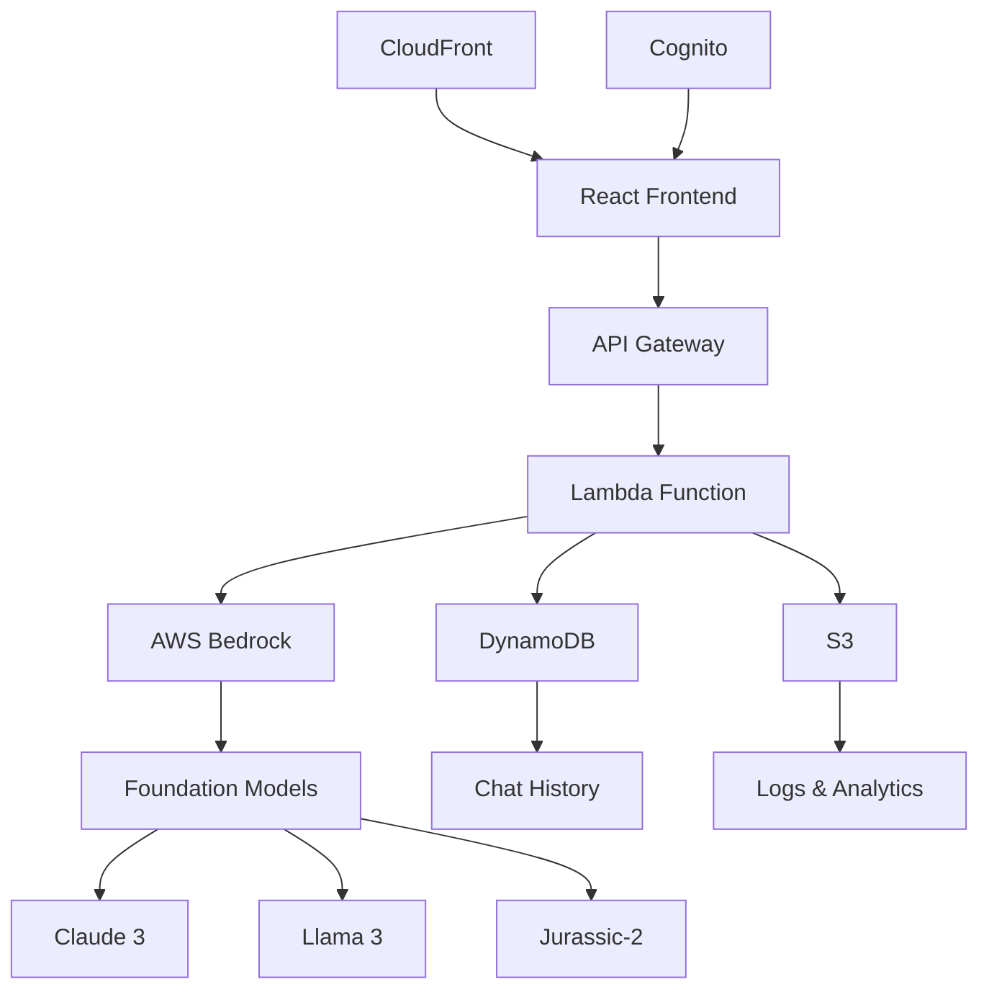

# 🛠️ Development Guide

Complete guide for developing and contributing to the AWS Bedrock GenAI Chatbot.

## 🏗️ Architecture Overview



## 📁 Project Structure

```
aws-bedrock-chatbot/
├── 📄 README.md                    # Main documentation
├── 📄 template.yaml                # AWS SAM template
├── 📄 .gitignore                   # Git ignore rules
│
├── 📁 frontend/                    # React application
│   ├── 📁 src/
│   │   ├── 📄 App.js               # Main app component
│   │   ├── 📄 App.css              # Global styles
│   │   └── 📁 components/
│   │       ├── 📄 ChatInterface.js # Chat UI component
│   │       ├── 📄 DomainSelector.js# Domain selection
│   │       └── 📄 ModelSelector.js # Model selection
│   ├── 📄 package.json             # Dependencies
│   └── 📄 .env.example             # Environment template
│
├── 📁 lambda/                      # Backend functions
│   ├── 📄 bedrock_handler.py       # Main chat handler
│   ├── 📄 models_handler.py        # Models list handler
│   └── 📄 requirements.txt         # Python dependencies
│
├── 📁 infrastructure/              # AWS setup scripts
│   ├── 📁 aws-setup/
│   ├── 📁 api-gateway/
│   └── 📁 cognito/
│
├── 📁 scripts/                     # Deployment scripts
│   ├── 📄 deploy.sh                # Main deployment
│   ├── 📄 deploy-frontend-prod.sh  # Frontend deployment
│   ├── 📄 start-frontend.sh        # Local development
│   └── 📄 test-api.sh              # API testing
│
├── 📁 docs/                        # Documentation
│   ├── 📄 DEPLOYMENT.md            # Deployment guide
│   ├── 📄 API.md                   # API documentation
│   └── 📄 DEVELOPMENT.md           # This file
│
└── 📁 examples/                    # Use case examples
    └── 📄 use-cases.md              # Domain examples
```

## 🚀 Local Development Setup

### 1. Prerequisites

```bash
# Install Node.js (18+)
node --version

# Install Python (3.11+)
python --version

# Install AWS CLI
aws --version

# Install SAM CLI
sam --version
```

### 2. Clone and Setup

```bash
git clone https://github.com/yourusername/aws-bedrock-chatbot.git
cd aws-bedrock-chatbot

# Install frontend dependencies
cd frontend
npm install
cd ..

# Install Python dependencies for local testing
cd lambda
pip install -r requirements.txt
cd ..
```

### 3. Environment Configuration

```bash
# Copy environment template
cp frontend/.env.example frontend/.env

# Edit with your API endpoint
nano frontend/.env
```

### 4. Start Development

```bash
# Start frontend (always on port 3000)
./scripts/start-frontend.sh

# In another terminal, test API
./scripts/test-api.sh
```

## 🧪 Testing

### Unit Tests

```bash
# Frontend tests
cd frontend
npm test

# Lambda function tests
cd lambda
python -m pytest tests/
```

### Integration Tests

```bash
# Test API endpoints
./scripts/test-api.sh

# Test different domains
curl -X POST $API_URL/chat \
  -H 'Content-Type: application/json' \
  -d '{"message": "Test HR", "domain": "hr"}'
```

### Load Testing

```bash
# Install artillery
npm install -g artillery

# Run load test
artillery run tests/load-test.yml
```

## 🎨 Frontend Development

### Component Structure

```javascript
// Main App component
App.js
├── DomainSelector.js     # Domain selection UI
├── ModelSelector.js      # AI model selection
├── ChatInterface.js      # Main chat component
└── ChatHistory.js        # Conversation history
```

### State Management

```javascript
// App-level state
const [selectedDomain, setSelectedDomain] = useState('general');
const [selectedModel, setSelectedModel] = useState('claude-3-haiku');
const [chatHistory, setChatHistory] = useState([]);
const [sessionId, setSessionId] = useState(null);
```

### API Integration

```javascript
// API service
const ChatAPI = {
  sendMessage: async (message, domain, modelId) => {
    const response = await fetch(`${API_URL}/chat`, {
      method: 'POST',
      headers: { 'Content-Type': 'application/json' },
      body: JSON.stringify({ message, domain, model_id: modelId })
    });
    return response.json();
  }
};
```

### Styling Guidelines

- Use CSS modules or styled-components
- Follow mobile-first responsive design
- Maintain consistent color scheme
- Use semantic HTML elements
- Ensure accessibility (ARIA labels, keyboard navigation)

## ⚙️ Backend Development

### Lambda Function Structure

```python
# Main handler structure
def lambda_handler(event, context):
    # 1. Parse request
    # 2. Validate input
    # 3. Route to appropriate model
    # 4. Process response
    # 5. Save to database
    # 6. Return formatted response
```

### Adding New Domains

1. **Update domain prompts:**

```python
# In lambda/bedrock_handler.py
DOMAIN_PROMPTS = {
    'your_new_domain': """Your specialized prompt here..."""
}
```

2. **Add frontend support:**

```javascript
// In frontend/src/components/DomainSelector.js
const domains = [
    { id: 'your_new_domain', label: 'Your Domain', icon: '🆕' }
];
```

### Adding New Models

1. **Update model configurations:**

```python
# In lambda/bedrock_handler.py
MODEL_CONFIGS = {
    'new.model-id': {
        'max_tokens': 4000,
        'temperature': 0.7
    }
}
```

2. **Implement model-specific handler:**

```python
def invoke_new_model(model_id, prompt):
    # Model-specific implementation
    pass
```

### Database Schema

**DynamoDB Table: `bedrock-chat-history`**

```json
{
  "session_id": "string",      // Partition key
  "timestamp": "string",       // Sort key
  "user_message": "string",    // User input
  "bot_response": "string",    // AI response
  "domain": "string",          // Domain used
  "model_id": "string"         // Model used
}
```

## 🔧 Infrastructure as Code

### SAM Template Structure

```yaml
# template.yaml
Resources:
  # Lambda Functions
  BedrockChatbotFunction:
    Type: AWS::Serverless::Function
    
  # API Gateway
  BedrockChatbotApi:
    Type: AWS::Serverless::Api
    
  # DynamoDB Table
  ChatHistoryTable:
    Type: AWS::DynamoDB::Table
    
  # IAM Roles
  BedrockChatbotRole:
    Type: AWS::IAM::Role
```

### Environment Variables

```yaml
Environment:
  Variables:
    CHAT_HISTORY_TABLE: !Ref ChatHistoryTable
    LOGS_BUCKET: !Ref LogsBucket
    ENVIRONMENT: !Ref Environment
```

### Custom Resources

```python
# For custom setup requirements
def custom_resource_handler(event, context):
    # Custom logic here
    pass
```

## 📊 Monitoring and Debugging

### CloudWatch Logs

```bash
# View Lambda logs
aws logs tail /aws/lambda/bedrock-chatbot-handler-prod --follow

# View API Gateway logs
aws logs tail API-Gateway-Execution-Logs_YOUR_API_ID/prod --follow
```

### Local Debugging

```python
# Lambda local testing
import json
from lambda.bedrock_handler import lambda_handler

# Test event
event = {
    'body': json.dumps({
        'message': 'Test message',
        'domain': 'general'
    }),
    'httpMethod': 'POST'
}

response = lambda_handler(event, None)
print(response)
```

### Frontend Debugging

```javascript
// Enable debug mode
localStorage.setItem('debug', 'true');

// Debug API calls
const originalFetch = window.fetch;
window.fetch = (...args) => {
  console.log('API Call:', args);
  return originalFetch(...args);
};
```

## 🚀 Deployment Workflow

### Development Workflow

1. **Make changes** to code
2. **Test locally** with `./scripts/start-frontend.sh`
3. **Test API** with `./scripts/test-api.sh`
4. **Deploy backend** with `sam deploy`
5. **Deploy frontend** with `./scripts/deploy-frontend-prod.sh`

### CI/CD Pipeline

```yaml
# .github/workflows/deploy.yml
name: Deploy Bedrock Chatbot
on:
  push:
    branches: [main]
    
jobs:
  test:
    runs-on: ubuntu-latest
    steps:
      - uses: actions/checkout@v3
      - name: Run Tests
        run: |
          cd frontend && npm test
          cd ../lambda && python -m pytest
          
  deploy:
    needs: test
    runs-on: ubuntu-latest
    steps:
      - uses: actions/checkout@v3
      - name: Deploy Backend
        run: ./scripts/deploy.sh
      - name: Deploy Frontend
        run: ./scripts/deploy-frontend-prod.sh
```

## 🔐 Security Development

### Input Validation

```python
def validate_input(message, domain, model_id):
    # Length validation
    if len(message) > 4000:
        raise ValueError("Message too long")
    
    # Domain validation
    valid_domains = ['general', 'hr', 'medical', 'legal', 'finance']
    if domain not in valid_domains:
        raise ValueError("Invalid domain")
    
    # Model validation
    if model_id not in MODEL_CONFIGS:
        raise ValueError("Invalid model")
```

### Output Sanitization

```python
def sanitize_response(response):
    # Remove potential sensitive data
    sanitized = re.sub(r'\b\d{3}-\d{2}-\d{4}\b', '[SSN-REDACTED]', response)
    sanitized = re.sub(r'\b\d{4}\s?\d{4}\s?\d{4}\s?\d{4}\b', '[CARD-REDACTED]', sanitized)
    return sanitized
```

### CORS Configuration

```python
def create_response(status_code, body):
    return {
        'statusCode': status_code,
        'headers': {
            'Access-Control-Allow-Origin': '*',  # Configure for production
            'Access-Control-Allow-Methods': 'GET,POST,OPTIONS',
            'Access-Control-Allow-Headers': 'Content-Type,Authorization'
        },
        'body': json.dumps(body)
    }
```

## 🐛 Common Issues and Solutions

### Frontend Issues

**1. CORS Errors**
```javascript
// Solution: Ensure backend returns proper CORS headers
// Check: Lambda function CORS configuration
```

**2. Port Conflicts**
```bash
# Solution: Use the start script which handles port cleanup
./scripts/start-frontend.sh
```

### Backend Issues

**1. Bedrock Access Denied**
```python
# Solution: Enable model access in AWS Console
# Check: IAM permissions for Bedrock service
```

**2. Lambda Timeout**
```yaml
# Solution: Increase timeout in template.yaml
Timeout: 60  # seconds
```

### Deployment Issues

**1. Stack Update Failed**
```bash
# Solution: Delete and recreate stack
aws cloudformation delete-stack --stack-name bedrock-chatbot
./scripts/deploy.sh
```

**2. CloudFront Not Working**
```bash
# Solution: Wait for propagation or check status
./scripts/check-cloudfront.sh
```

## 📈 Performance Optimization

### Frontend Optimization

```javascript
// Code splitting
const ChatInterface = lazy(() => import('./components/ChatInterface'));

// Memoization
const MemoizedComponent = memo(Component);

// Service worker for caching
// In public/sw.js
```

### Backend Optimization

```python
# Connection reuse
bedrock_client = boto3.client('bedrock-runtime')  # Global

# Caching responses
from functools import lru_cache

@lru_cache(maxsize=100)
def get_cached_response(message_hash):
    # Check cache first
    pass
```

### Database Optimization

```python
# Batch operations
def batch_write_items(items):
    with table.batch_writer() as batch:
        for item in items:
            batch.put_item(Item=item)

# Query optimization
table.query(
    IndexName='timestamp-index',
    KeyConditionExpression=Key('session_id').eq(session_id),
    ScanIndexForward=False,
    Limit=10
)
```

## 🎯 Contributing Guidelines

### Code Style

- **Python**: Follow PEP 8
- **JavaScript**: Use ESLint and Prettier
- **Documentation**: Update docs with changes
- **Testing**: Add tests for new features

### Pull Request Process

1. Fork the repository
2. Create feature branch (`git checkout -b feature/amazing-feature`)
3. Commit changes (`git commit -m 'Add amazing feature'`)
4. Push to branch (`git push origin feature/amazing-feature`)
5. Open Pull Request

### Commit Messages

```
feat: add new medical domain support
fix: resolve CORS issue in production
docs: update API documentation
test: add unit tests for chat handler
refactor: optimize model selection logic
```

This development guide should help you understand, modify, and extend the AWS Bedrock GenAI Chatbot effectively!
